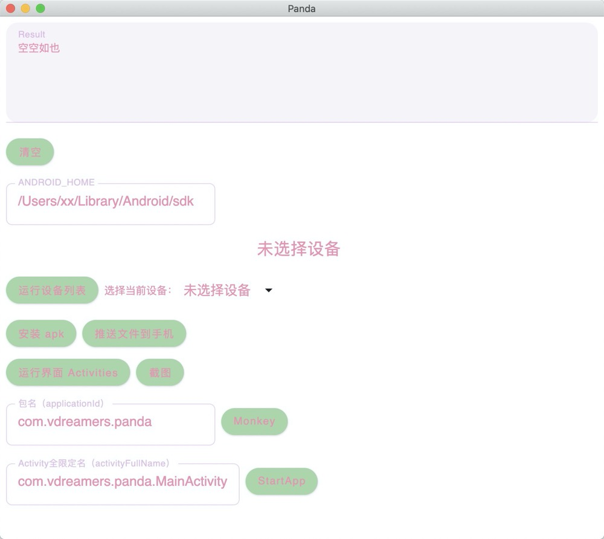

[](https://travis-ci.org/CodePoem/panda)

panda is a adb lazy guy.


Usage
-----

running screenshot:



Develop
--------

[Compose for Desktop](https://github.com/JetBrains/compose-jb)

### Running desktop application

JDK 15+

```shell
./gradlew :desktop:run
```

### Building native desktop distribution

JDK 16+

```shell
./gradlew :desktop:package
```

outputs dir is desktop/build/compose/binaries.

License
-------

    Copyright 2021 CodePoem

    Licensed under the Apache License, Version 2.0 (the "License");
    you may not use this file except in compliance with the License.
    You may obtain a copy of the License at

       http://www.apache.org/licenses/LICENSE-2.0

    Unless required by applicable law or agreed to in writing, software
    distributed under the License is distributed on an "AS IS" BASIS,
    WITHOUT WARRANTIES OR CONDITIONS OF ANY KIND, either express or implied.
    See the License for the specific language governing permissions and
    limitations under the License.


